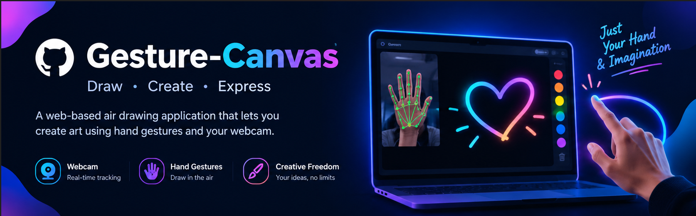

  

<h1 align="center">🎨 Gesture-Canvas — Air Drawing</h1>

  <b>Draw • Create • Express</b>

  A web-based air drawing application that allows users to draw digitally using hand gestures and a webcam.

---

# 📌 About The Project

**Gesture-Canvas** is an interactive air-drawing web application built using **HTML, CSS, and JavaScript**.

Instead of using a traditional mouse or drawing tablet, the application uses a webcam to detect the user's hand and track the **index finger**.

The movement of the index finger is converted into a drawing path on a digital canvas.

The main goal of this project is to combine:

- 🖐️ Hand Gesture Recognition
- 🎥 Webcam Input
- 🎨 Digital Drawing
- 🌐 Web Technologies
- ⚡ Real-Time Interaction

The project demonstrates how computer vision and web technologies can be combined to create a fun and interactive user experience.

---

# ✨ Features

## 🖐️ Hand Gesture Drawing

Draw on the digital canvas by moving your index finger in front of the webcam.

## 🎥 Real-Time Hand Tracking

The application detects and tracks the user's hand using webcam input.

## ✏️ Air Drawing

No physical mouse or drawing tablet is required.

Simply move your finger in the air and create your artwork digitally.

## 🎨 Multiple Colors

Choose different colors for your drawing.

Available colors include:

- 🔴 Red
- 🟠 Orange
- 🟡 Yellow
- 🟢 Green
- 🔵 Blue
- 🟣 Purple
- ⚫ Black
- ⚪ White
- 🩷 Pink
- 🩵 Cyan
- 🟤 Brown
- 🩶 Gray

## 🧽 Eraser

Use the eraser tool to remove parts of your drawing.

## ↩️ Undo

Undo previous drawing actions.

## 🗑️ Clear Canvas

Clear the entire canvas and start a new drawing.

## 💾 Save Drawing

Save your artwork as a PNG image.

## 🎯 Gesture-Based Controls

Interact with application controls using hand movements.

## ⚡ Smooth Finger Tracking

Position smoothing helps reduce sudden movements and creates a more natural drawing experience.

## 📱 Responsive Interface

The interface is designed to adapt to different screen sizes.

---

🔮 Future Enhancements

Possible future improvements include:

👥 Multi-hand drawing
✋ More gesture controls
🎨 Custom brush styles
📏 Adjustable brush size
🌈 Gradient drawing
🖼️ Image import
🔤 Gesture-based text
🎬 Drawing animation recording
📱 Improved mobile support
🤖 Advanced AI-based gesture recognition

📸 Project Preview

The project provides an interactive workspace where users can see their webcam hand tracking and create drawings digitally.

## 👨‍💻 About Me

Hi! I'm **John Navin N.**, an engineering student and beginner developer interested in building creative and interactive applications.

I have basic knowledge of:

- Python
- C
- C++
- Java
- HTML
- CSS
- JavaScript
- Frontend & Backend Development
- Artificial Intelligence

I enjoy creating small projects, experimenting with new technologies, and learning by building real-world applications.

This project is one of my projects created to explore **web development, computer vision, hand tracking, and interactive user interfaces**.

---

👨‍💻 Author

Jaanavin.N

Engineering Student | Beginner Developer

Interested in:

Web Development
Programming
Artificial Intelligence
Creative Projects
Interactive Applications
